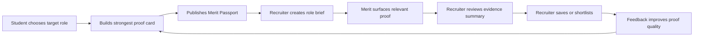

# Product Strategy

## What Merit Is

Merit is a proof-based hiring platform for early-career talent.

It helps students turn real work into structured evidence, and helps recruiters evaluate that evidence faster than they can evaluate resumes, LinkedIn profiles, or scattered portfolio links.

Recommended product definition:

> Merit helps companies make better early-career hiring decisions by surfacing structured evidence of what candidates have actually built.

## What Merit Is Not

Merit is not:

- A prettier LinkedIn profile.
- A generic student portfolio site.
- A Behance or Dribbble clone.
- A GitHub replacement.
- A job board with project cards.
- A resume builder.
- An AI system that decides who should be hired.

Merit should not replace recruiter judgment. It should help recruiters find the right evidence faster.

## Who Merit Serves

### Students

Students use Merit to prove they can do the role they want.

They need:

- A simple way to build one strong proof card.
- Help explaining contribution, skill, and outcome.
- A public passport recruiters can understand.
- Feedback on missing proof.

### Recruiters

Recruiters use Merit to answer:

> Who should I interview, and why?

They need:

- Role-specific search.
- Evidence summaries.
- Candidate comparison.
- Clear gaps and caveats.
- Shortlist workflow.

### Founders and Hiring Managers

Founder-led teams often do not have time to screen weak early-career applications. They need proof-first shortlists more than they need another large database.

### Universities and Programs

Institutions can eventually use Merit to show student outcomes, but this should wait until recruiter pull is proven.

## Who Pays

The primary payer should be the recruiter, hiring manager, startup, agency, SME, or talent program that benefits from faster shortlisting.

Student accounts should stay free or mostly free because student proof supply is the marketplace input.

Possible paid units:

- Curated candidate batch.
- Recruiter workspace subscription.
- Contact unlock.
- Role-based matching.
- Institution/cohort plans later.

## Core Asset

The core asset is not a profile. The core asset is structured evidence.

The most important product object is the **Proof Card**:

- What was built.
- Who built what part.
- What role it targets.
- What skills it demonstrates.
- What artifact proves it.
- What outcome or validation exists.
- What evidence is missing.

The **Merit Passport** is the container around multiple proof cards.

## Core Loop

The PMF loop succeeds when recruiters repeatedly produce qualified shortlists from structured proof.

## Why Recruiters Should Care

Recruiters should care because early-career resumes are low-signal.

Merit gives them:

- Faster screening.
- Better context.
- Evidence-backed skills.
- Clear contribution history.
- Candidate comparison.
- Missing-proof visibility.
- Shortlist rationale they can defend.

The recruiter promise:

> See ability before the interview.

## Why Students Should Care

Students should care because their strongest work is usually scattered and under-explained.

Merit gives them:

- A credible public proof passport.
- A way to prove target-role readiness.
- A structure for explaining their strongest project.
- A better surface than a resume alone.
- A chance to be discovered for work, not pedigree.

The student promise:

> Make your work your credential.

## Why This Is Different

### LinkedIn

LinkedIn is a professional graph. It shows people, experience, posts, and networks. Merit should show inspectable work evidence mapped to early-career roles.

### GitHub

GitHub shows code history well, but it is weak for design, business, research, decks, prototypes, and cross-disciplinary work. Merit should interpret proof across disciplines.

### Behance and Dribbble

Behance and Dribbble showcase visual work. Merit should explain what the work proves for hiring decisions.

### Portfolio Sites

Portfolio sites are expressive but unstructured. Merit should be recruiter-readable by default.

### Handshake and Job Boards

Handshake and job boards are access and application channels. Merit should be the proof layer that helps recruiters understand ability.

### AI Sourcing Tools

AI sourcing tools often focus on finding and ranking people. Merit should focus on organizing evidence and explaining relevance without pretending certainty.

## Strategic Language

Use:

- Proof
- Evidence
- Signal
- Passport
- Proof card
- Role fit
- Evidence summary
- Missing proof
- Shortlist rationale

Avoid overusing:

- Portfolio
- Profile completion
- AI score
- Best candidate
- Verified by AI
- Likes/views/saves as primary signals

