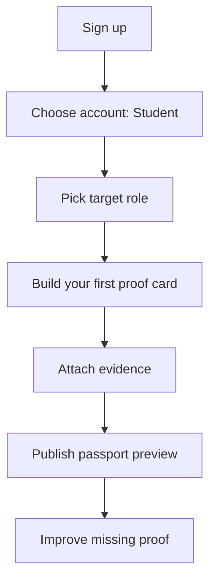
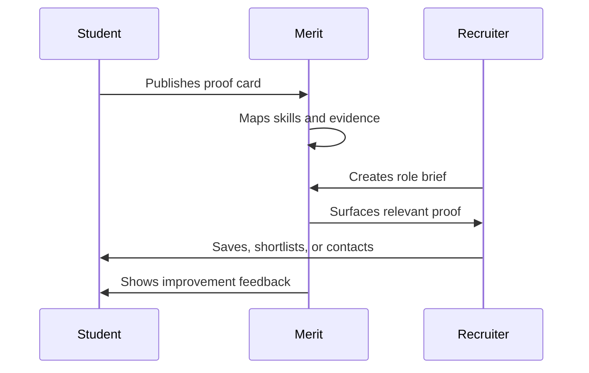
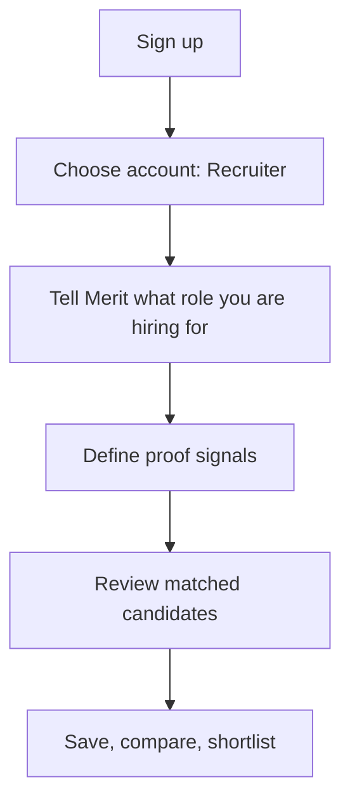

# User Flows

## Student Flow: First Signup

Entry promise:

> Build your first proof card.

Do not lead with:

> Complete your profile.

## Student Flow: Choose Target Role

1. Student selects one primary target role.
2. Merit asks what work proves readiness for that role.
3. Student can add secondary target roles later.
4. Role affects proof prompts, readiness checklist, and recruiter summaries.

Microcopy:

> What role do you want your work to prove?

Edge cases:

- Student is undecided: offer "exploring" plus suggested roles.
- Student chooses broad role: ask for a narrower first proof target.

## Student Flow: Add Strongest Project

1. Student names the project.
2. Student explains what they personally contributed.
3. Student selects project type.
4. Student writes one recruiter-readable proof claim.
5. Student uploads or links evidence.

Microcopy:

> Pick the project that would make a recruiter pause.

## Student Flow: Add Evidence

Evidence entry supports:

- Upload file.
- Paste link.
- Add screenshot.
- Add GitHub/Figma/live demo.
- Add testimonial or outcome.

Validation:

- At least one artifact or link required for evidence level 2+.
- Ask for contribution if team project is selected.

## Student Flow: Publish Proof Card

1. Merit shows proof card preview.
2. Student sees evidence level and gaps.
3. Student publishes.
4. Merit routes to passport preview.

Success state:

> Your first proof card is live. Recruiters can now evaluate this work.

## Student Flow: Improve Profile

After first proof card:

1. Add contact.
2. Add CV.
3. Add second proof card.
4. Add missing outcome.
5. Add external validation.

Do not block publish until every field is perfect.

## Student Flow: Get Discovered

## Recruiter Flow: First Signup

Entry promise:

> Tell Merit what role you are hiring for.

Do not lead with:

> Browse profiles.

## Recruiter Flow: Create Role Brief

1. Recruiter adds role title.
2. Recruiter adds hiring context.
3. Recruiter selects must-have skills.
4. Recruiter selects evidence preferences.
5. Recruiter sets availability/location constraints.
6. Merit generates initial search.

Microcopy:

> Merit will look for proof, not just keywords.

## Recruiter Flow: Search Candidates

1. Recruiter lands in evidence search workspace.
2. Left rail shows role brief and filters.
3. Center shows candidate evidence results.
4. Right panel previews selected candidate proof.

Primary action:

> View evidence

Secondary actions:

> Save, compare, hide

## Recruiter Flow: Review Evidence Summaries

Each result explains:

- Why this candidate may be relevant.
- Strongest matching project.
- Skills demonstrated.
- Evidence level.
- Missing evidence.

AI wording:

> Evidence found.

Not:

> AI verified.

## Recruiter Flow: Open Candidate Evidence Profile

1. Open full candidate evidence view.
2. Review role fit summary.
3. Inspect strongest proof card.
4. Check gaps.
5. Add note.
6. Save, compare, shortlist, or contact.

## Recruiter Flow: Save / Shortlist

States:

- Saved: worth revisiting.
- Compare: needs side-by-side review.
- Shortlisted: worth interviewing.
- Contacted: outreach sent.
- Archived: not relevant now.

## Recruiter Flow: Compare Candidates

1. Recruiter chooses 2-4 candidates.
2. Comparison table shows evidence, outcomes, skills, gaps.
3. Recruiter adds notes.
4. Recruiter shortlists or removes candidates.

## Recruiter Flow: Contact Candidate

1. Recruiter confirms candidate contact info.
2. Merit shows candidate's target role and strongest proof.
3. Recruiter copies contact or sends outreach later.
4. Candidate state becomes Contacted.

