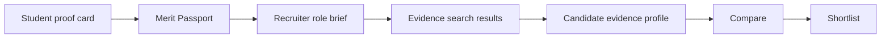

# Visual Wireframes

This file pairs with SVG and HTML artifacts in [visuals/](visuals/).

## Visual Output Index

- [visuals/index.html](visuals/index.html): static low-fidelity preview.
- [visuals/landing-page.svg](visuals/landing-page.svg)
- [visuals/recruiter-search-results.svg](visuals/recruiter-search-results.svg)
- [visuals/candidate-evidence-profile.svg](visuals/candidate-evidence-profile.svg)
- [visuals/student-proof-builder.svg](visuals/student-proof-builder.svg)
- [visuals/project-proof-card.svg](visuals/project-proof-card.svg)
- [visuals/candidate-comparison.svg](visuals/candidate-comparison.svg)
- [visuals/student-public-profile.svg](visuals/student-public-profile.svg)

## Landing Page

```text
+--------------------------------------------------------------------------------+
| Merit                                         Proof | Students | Recruiters     |
+--------------------------------------------------------------------------------+
|                                                                                |
| Proven by work.                                      [Build passport] [Recruit] |
| Merit turns student projects into recruiter-readable proof.                    |
|                                                                                |
|  +----------------------- Proof Card -----------------------+   + Shortlist +   |
|  | Artifact preview | Contribution | Skills | Outcome       |-->| 3 candidates | |
|  +----------------------------------------------------------+   +------------+ |
|                                                                                |
| Next section preview: resumes claim, Merit shows evidence                       |
+--------------------------------------------------------------------------------+
```

## Recruiter Search Results

```text
+------------------+------------------------------------+------------------------+
| ROLE BRIEF       | RESULTS                            | EVIDENCE PREVIEW       |
| Frontend Intern  | Amira Tan                          | Why relevant           |
| React, UI, demos | Strong evidence match              | - Shipped dashboard    |
| Evidence L3+     | Proof: Next.js dashboard           | - React + UI evidence  |
| Filters          | Gaps: no usage metrics             | Missing: usage data    |
|                  | [View evidence] [Save] [Compare]   | [Shortlist] [Open]     |
+------------------+------------------------------------+------------------------+
```

## Candidate Evidence Profile

```text
+--------------------------------------------------------------------------------+
| Amira Tan | Frontend Intern | Singapore | [Shortlist] [Contact] [Compare]      |
+--------------------------------------------------------------------------------+
| Evidence summary: may be relevant because...                                    |
|                                                                                |
| + Strongest Proof ------------------------------------------------------------+ |
| | Artifact preview | Built admin dashboard | Contribution | Evidence Level 3   | |
| +----------------------------------------------------------------------------+ |
|                                                                                |
| Skills backed by evidence     Missing evidence       Recruiter notes           |
| React x2, UI systems, QA      Usage metrics          [textarea]                |
+--------------------------------------------------------------------------------+
```

## Student Proof Builder

```text
+--------------------------------------------+-----------------------------------+
| Build your first proof card                 | Live recruiter preview            |
| 1. Target role                              | + Proof Card -------------------+ |
| 2. Project title                            | | What it proves                 | |
| 3. Personal contribution                    | | Evidence level                 | |
| 4. Evidence upload/link                     | | Skills + outcome               | |
| 5. Skills demonstrated                      | +-------------------------------+ |
| 6. Outcome                                  | Gaps: contribution unclear       |
| [Save draft] [Publish proof card]           |                                   |
+--------------------------------------------+-----------------------------------+
```

## Project Proof Card

```text
+------------------------------------------+
| Artifact preview                         |
|------------------------------------------|
| Proves: React UI implementation          |
| Admin dashboard for student review ops   |
| Contribution: solo frontend build        |
| Skills: React, forms, data tables        |
| Evidence: live demo + screenshots        |
| Outcome: used in demo review             |
| Missing: usage metrics                   |
| [Inspect proof]                          |
+------------------------------------------+
```

## Candidate Comparison

```text
+----------------+----------------+----------------+----------------+
|                | Amira          | Dev            | Priya          |
+----------------+----------------+----------------+----------------+
| Role fit       | Strong         | Partial        | Strong         |
| Strongest proof| Dashboard      | API prototype  | Design system  |
| Evidence level | L3             | L2             | L4             |
| Outcome        | Demo shipped   | Screenshot     | Client quote   |
| Gaps           | Usage metrics  | Repo missing   | None major     |
| Action         | Shortlist      | Save           | Shortlist      |
+----------------+----------------+----------------+----------------+
```

## Student Public Profile

```text
+--------------------------------------------------------------------------------+
| Candidate Passport: Amira Tan | Frontend Intern | [Contact] [Share]            |
+--------------------------------------------------------------------------------+
| Strongest proof: Admin dashboard                                                |
| + artifact + proof claim + contribution + evidence level                        |
|                                                                                |
| Evidence-backed skills      Proof timeline                 CV / Contact         |
| React x2, UI x3             3 proof cards                  PDF + email          |
+--------------------------------------------------------------------------------+
```

## Core Flow Diagram



